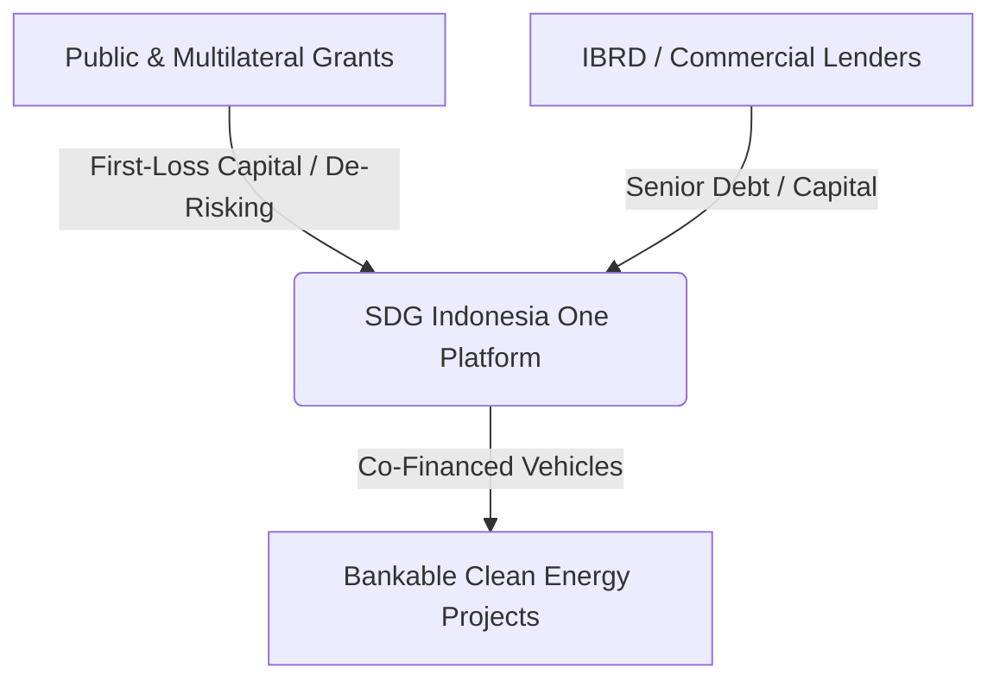

Indonesia’s target to achieve Net Zero Emission by 2060 is no longer a paper-bound ambition; it is a live stress test for the nation’s fiscal architecture. The Ministry of Finance estimates a climate financing gap of Rp3,461 trillion—equivalent to USD 220 billion—through 2030. The number is staggering, but the strategic implication is immediate: the state budget (APBN) cannot shoulder this energy transition alone. As public fiscal space tightens, capital deployment is shifting from direct public spending to strategic de-risking mechanisms designed to mobilize institutional capital.

Blended finance has consequently evolved from a philanthropic experiment into a critical pillar of national infrastructure strategy. By deploying public capital or concessions as first-loss or risk-mitigation layers, green infrastructure projects—spanning wind, hydro, and ecological restoration—reach bankable risk profiles for global commercial investors. Within Indonesia, this structural engineering operates through an extended **4P** framework: Public, Private, Philanthropy, and People.

The operational backbone of this strategy is SDG Indonesia One (SIO), a national country platform managed by PT Sarana Multi Infrastruktur (Persero). SIO acts as a centralized vehicle to aggregate and de-risk capital deployment at scale. Official data confirms SIO has [mobilized USD 3.29 billion in investment commitments](https://en.antaranews.com/news/359153/blended-finance-platform-mobilizes-us329-billion-sdg-funds) from international donors and institutional lenders. Platform expansion remains active, underscored by a €7.82 million grant agreement with KfW Development Bank to establish the Green Bond Development Facility, aimed at [accelerating domestic green bond issuances](https://www.thestar.com.my/business/business-news/2026/02/12/smi-seals-grants-to-boost-green-finance).

## Multilateral Commitments and Systemic Execution Challenges

Multilateral support for Indonesia’s risk-mitigation infrastructure has scaled alongside domestic reform. The [World Bank approved a USD 2.13 billion financing package](https://www.worldbank.org/en/news/press-release/2025/06/16/world-bank-approves-investments-to-boost-indonesia-s-economic-growth-and-access-to-clean-energy) dedicated to sustainable growth and clean energy transition. A core component of this package is the USD 628 million allocated to the Sustainable Least-Cost Electrification-2 (ISLE-2) program, combining a USD 600 million IBRD loan with multilateral grant funding to extend solar and wind power access to 3.5 million residents in eastern regional grids across Kalimantan and Sumatra.

Despite massive capital commitments, structural friction at the operational level limits capital deployment velocity. Rigid Local Content Requirements (TKDN) create supply chain bottlenecks, delaying the adoption of cost-effective global renewable technologies. This tension between local supply demands and international sourcing mirrors broader challenges seen in [navigating global supply chain volatility](https://blog.envoyou.com/posts/lean-resilient-global-supply-chain-volatility).

Furthermore, legal ambiguity surrounding early coal-fired power plant (PLTU) retirements and alignment gaps between the Indonesia Green Taxonomy and international criteria force institutional investors to maintain conservative allocations. These structural hurdles are detailed in the [IEEFA energy transition financing analysis](https://ieefa.org/sites/default/files/2026-02/IEEFA%20Briefing%20Note_Building%20credibility%20in%20Indonesia%27s%20energy%20transition_February2026.pdf).

The trajectory of Indonesian blended finance indicates that capital availability is no longer the primary constraint; the hurdle lies in risk-engineering innovation. As institutional capital demands verifiable asset provenance and regulatory clarity, integration with emerging asset structures becomes essential. Future opportunity hinges on blending thematic sukuk instruments with modern capital tracking, reflecting broader digital infrastructure shifts explored in analyses of [computing-power coordination and infrastructure models](https://blog.envoyou.com/posts/ai-energy-paradox-computing-power-coordination).

The ultimate question for asset managers and energy developers is not whether private capital exists for the transition, but how rapidly market architects can design risk-adjusted vehicles that preserve commercial returns while satisfying global sustainability mandates.

### Key References & Institutional Sources

* [Bank Indonesia Presentation Book – Green Policy Q3-2025](https://www.bi.go.id/en/iru/presentation/Documents/Republic%20of%20Indonesia%20Presentation%20Book%20-%20Green%20Policy%20Q3-2025.pdf)
* [Convergence Finance Data & Analysis](https://www.convergence.finance/news/2JxHe7gu4yCImhQa4RFcRy/view)
* [Global Green Growth Institute (GGGI) Climate Finance Acceleration](https://gggi.org/indonesia-accelerates-climate-finance-to-unlock-private-investment-for-a-sustainable-future/)
* [UNDP Indonesia, OJK Institute, and SDGs National Secretariat Joint Initiative](https://www.undp.org/indonesia/press-releases/undp-indonesia-ojk-institute-and-sdgs-national-secretariat-join-forces-boost-blended-finance-capacity)
* [ResearchGate: Blended Finance Concept and Implementation in Indonesia](https://www.researchgate.net/publication/360110620_Blended_Finance_Konsep_Dan_Penerapan_di_Indonesia)
* [Climate Policy Initiative – SDG Indonesia One Partnership](https://www.climatepolicyinitiative.org/event/cpi-becomes-a-partner-to-sdg-indonesia-one/)
* [PT SMI Sustainable Infrastructure Financing Overview](https://www.straitstimes.com/paid-press-releases/pt-smi-strengthens-indonesias-sustainable-infrastructure-financing-20251218)
* [ResearchGate: Blended Finance for Renewable Energy Projects in PT SMI](https://www.researchgate.net/publication/395480918_Blended_Finance_for_Renewable_Energy_Project_in_PT_Sarana_Multi_Infrastruktur_PERSERO_Study_Case_Hydroelectric_and_Mini_Hydro_Powerplant)
* [Tri Hita Karana Forum – SDG Indonesia One & SDG Bond Framework](https://www.thkforum.org/thk-initiatives/sdg-indonesia-one-sdg-bond/)
* [Business Indonesia: World Bank Financing Package Approval](https://business-indonesia.org/news/world-bank-approves-usd-2-13-billion-financing-package-for-indonesia-economic-development)
* [Unlocking Capital for Sustainability Report](https://www.unlockingcapitalforsustainability.com/indonesia/2025)
