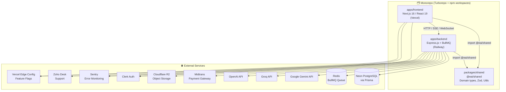

# 🧠 EAI (Envoyou AI) — Analisis Codebase

> **Versi:** 3.12.2 | **Stack:** TypeScript Monorepo | **Tanggal Analisis Terbaru:** 2026-07-18  
> **Revisi:** 2026-07-18 — Update Sprint 8.2 (Pemulihan Structured Output Provider, Quality Gate Recovery, dan Regression Coverage)

---

## 📐 Arsitektur Sistem



---

## 📁 Struktur Repository

```
/
├── apps/
│   ├── backend/          Express.js API + BullMQ Worker
│   └── frontend/         Next.js 16 App Router (i18n: en/id)
├── packages/
│   └── shared/           @eai/shared — types, schemas, utilities
├── turbo.json            Turborepo pipeline config
└── package.json          Root manifest (npm 11.14.1)
```

---

## 🖥️ Backend (`apps/backend`)

### Tech Stack
| Layer | Technology |
|---|---|
| Runtime | Node.js v24 + TypeScript (tsx watch) |
| Framework | Express.js v4 |
| Database | PostgreSQL via Prisma + Neon Serverless Adapter |
| Queue | BullMQ + ioredis (Redis) |
| AI Providers | Google Gemini (`@google/genai`), OpenAI, Groq |
| Auth | Clerk Backend SDK |
| Storage | Cloudflare R2 (AWS S3-compatible) |
| Payment | Midtrans |
| Build | tsup |

### API Routes (`src/routes/`)

| Route | Deskripsi | Status Arsitektur |
|---|---|---|
| `/api/analyze` | Core — pipeline analisis konten editorial | ✅ Modular (`routes/analyze/`) |
| `/api/admin` | Panel admin (user, org, credit adjustment, audit log) | ✅ Modular (`routes/admin/`) |
| `/api/strategist` | AI Strategist, Quick Draft & Blueprint Plan | ✅ Modular (`routes/strategist/`) |
| `/api/prompt-inspector` | Developer Console prompt AST inspector & diff | ✅ Active (`routes/prompt-inspector.ts`) |
| `/api/history` | Log riwayat analisis | Standard route |
| `/api/analytics` | Dashboard analytics organisasi | Standard route |
| `/api/onboarding` | Onboarding wizard multi-step | Standard route |
| `/api/payments` | Manajemen langganan & kredit | Standard route |
| `/api/checkout` | Integrasi Midtrans checkout | Standard route |
| `/api/workspace` | CRUD workspace per organisasi | Standard route |
| `/api/storage` | Upload ke Cloudflare R2 | Standard route |
| `/api/scrape` | Web scraper untuk referensi konten | Standard route |
| `/api/health` | Deep & shallow health check endpoint | Standard route |
| `/api/webhooks/clerk` | Sync user/org dari Clerk | Webhook route |
| `/api/webhooks/payment` | Notifikasi pembayaran Midtrans | Webhook route |
| `/api/editor` | Editor state utilities | Standard route |
| `/api/export` | Export artikel (Markdown, HTML, PDF) | Standard route |
| `/api/support` | Form support Zoho Desk | Standard route |
| `/api/public-stats` | Statistik publik | Standard route |

---

## 🤖 AI Prompt Engine (Composable PCA) — Fullstack Subsystem (v3.12.2)

Prompt Engine kini telah berevolusi dari sekelompok composer menjadi **subsystem penuh 3-layer** dengan kontrak structured output yang diuji langsung pada adapter provider:

```
Layer 1: Prompt Engine Subsystem Foundation
         ↓  AST node tree, base classes, CompositePromptNode, PromptRenderer, PromptSerializer, PromptPruningOptimizer

Layer 2: Prompt Components (Building Blocks)
         ↓  Core nodes (static, cacheable): facts, format, mission, rules, strategist, priority attributes
            Tenant nodes (dynamic): brand voice, editorial profile, workspace context

Layer 3: Workflow Composer & Inspection (Orchestration)
         ↓  Stage composers (9 composers: review, rewrite, refinement, quality gate, strategist, etc.)
            Prompt Inspector API (POST /api/prompt-inspector, /diff)
```

```
src/lib/ai/prompt-engine/
├── core/                        # Layer 2 — Static Prompt Components (Cacheable)
│   ├── facts.ts                 # Fakta platform
│   ├── format.ts                # Format output
│   ├── mission.ts               # Misi editorial
│   ├── rules.ts                 # Aturan editorial
│   └── strategist.ts            # Strategist core (dengan priority attribute & Fast Mode node)
├── tenant/                      # Layer 2 — Dynamic Prompt Components
│   ├── profile.ts               # Brand metadata, positioning, audience
│   └── tone.ts                  # Visual tone & few-shot examples
├── composer/                    # Layer 3 — Stage Composers
│   ├── review-composer.ts       # Multi-role review prompt composer
│   ├── rewrite-composer.ts      # Article rewrite stage composer
│   ├── refinement-composer.ts   # Iterative refinement composer
│   ├── quality-gate-composer.ts # Quality Gate compliance composer
│   ├── strategist-composer.ts   # Quick draft & outline composer
│   ├── seo-composer.ts          # SEO metadata composer
│   ├── strategist-chat-composer.ts
│   ├── strategist-blueprint-composer.ts
│   └── draft-from-notes-composer.ts
├── pricing.ts                   # Catalog harga model & estimasi biaya API
├── token-estimator.ts           # Token estimator (offline character-weighted & online SHA-256 cache)
├── cache-planner.ts             # Analyzer layout caching prompt (static vs dynamic order)
├── cache-optimizer.ts           # Suggestion engine perbaikan tata letak prompt AST
├── renderer.ts                  # PromptRenderer (normalisasi whitespace & validasi XML tag)
├── serializer.ts                # PromptSerializer (serialisasi 2-arah AST <-> JSON)
├── pruning-optimizer.ts        # PromptPruningOptimizer (pemangkasan node opsional berdasarkan token budget)
└── __tests__/                   # 62 unit tests untuk AST, estimator, planner, & grounding unfurl
```

### 🗺️ Status Prompt Engine Capability Matrix

| Komponen | Status | Deskripsi |
|---|---|---|
| **AST Tree Nodes** | ✅ Ready | Base `PromptNode`, `CompositePromptNode`, dan atribut `priority` (scale 1-5) |
| **Workflow Composers** | ✅ Ready | 9 stage composers terintegrasi dengan Gemini Prompt Caching |
| **PromptRenderer** | ✅ Ready | Visual text renderer dengan normalisasi whitespace & validasi XML boundary |
| **PromptSerializer** | ✅ Ready | Bidirectional AST <-> JSON serialization |
| **PromptPruningOptimizer** | ✅ Ready | Auto-prune node opsional saat prompt melebihi batas budget token LLM |
| **Token Estimator** | ✅ Ready | Offline character-weighted estimator & online SHA-256 cache 30m TTL |
| **Cache Planner & Optimizer**| ✅ Ready | Analyzer static/dynamic prefix boundary & auto-suggestion rule engine |
| **Prompt Inspector API** | ✅ Ready | Developer console API `/api/prompt-inspector` & `/diff` |
| **Grounding Redirect Unfurl**| ✅ Ready | Unfurl URL `vertexaisearch` 302 redirect + automatic leak sanitizer |

---

## 🎨 Frontend (`apps/frontend`)

### Tech Stack
| Layer | Technology |
|---|---|
| Framework | Next.js 16.2.6 (App Router) |
| React | 19.2.4 |
| Auth | Clerk Next.js |
| i18n | next-intl (en/id) |
| Editor | TipTap v3 (ProseMirror) |
| UI Components | Base UI + shadcn/ui + Tailwind CSS v4 |
| Animation | Framer Motion v12 |
| Monitoring | Sentry |
| Fonts | Inter, DM Serif Display, Lora, JetBrains Mono |

### Status Komponen Utama

| Komponen | Ukuran Asli | Status Arsitektur Saat Ini |
|---|---|---|
| `EditorialWorkspace.tsx` | 88KB | ✅ Modular (`src/components/editorial-workspace/` + Facade Shell ~33KB) |
| `UserDirectory.tsx` | 73KB | ✅ Modular (`src/components/user-directory/` + Facade Shell 9.2KB) |
| `FeedbackPanel.tsx` | 44KB | ✅ Modular (`src/components/feedback-panel/` + Facade Shell < 100 LOC) |
| `StrategistTab.tsx` | 40KB | ✅ Modular (`src/components/strategist-tab/` + Facade Shell < 100 LOC) |
| `OnboardingWizard.tsx` | 46KB | Stable |
| `BillingAdmin.tsx` | 47KB | Stable |
| `Editor.tsx` | 30KB | Stable wrapper TipTap |
| `FinalDraftPanel.tsx` | 41KB | Stable |

---

## 🔍 Ringkasan Pencapaian Refactoring (Sprint 8–8.2)

1. **Modularisasi UI `FeedbackPanel` (44KB -> `components/feedback-panel/`)**: Memisahkan komponen UI monolitik ke dalam `types.ts`, `hooks/useFeedbackActions.ts`, `FeedbackItemCard.tsx`, `QualityGateSummary.tsx`, dan facade shell ramping.
2. **Modularisasi UI `StrategistTab` (40KB -> `components/strategist-tab/`)**: Memisahkan antarmuka AI Strategist chat ke dalam `types.ts`, `hooks/useStrategistChat.ts`, `SessionSidebar.tsx`, `ChatMessageList.tsx`, `ChatInputBar.tsx`, dan facade shell ramping.
3. **Perluasan Unit Test Backend**: Menambahkan unit test suite terisolasi di `chat-billing.test.ts` (saldo kredit, deduction, usage logging) dan `user-workspace.test.ts` (konteks organisasi Clerk & user record), lalu menambahkan test transport provider dan normalisasi Quality Gate pada Sprint 8.2.
4. **Fix Quality Gate Zod Schema & Candidate Normalizer (Sprint 8.1)**:
   - Menyelaraskan batasan array `changes` pada `FinalQualityGateResponseSchema` di `@eai/shared` dari `.min(2)` menjadi `.min(1).max(5)` agar tidak melempar error Zod saat artikel hanya mengalami 1 perbaikan terfokus.
   - Memperkuat `normalizeFinalQualityGateResponseCandidate` dengan melengkapi fallback otomatis `['Processed draft according to editorial brief.']` saat array `changes` dari LLM kosong.
5. **Fix Feedback Action & Safe Apply Logic (Sprint 8.1)**:
   - Menghapus fallback berbahaya di `useEditorialWorkspace.ts` yang menambahkan teks saran langsung ke bawah draf artikel saat `targetText` kosong.
   - Mengganti tombol "Apply Suggestion" untuk feedback tanpa `targetText` menjadi tombol **"Copy Suggestion"** di `FeedbackItemCard.tsx` untuk mencegah korupsi teks draf final.
6. **Pemulihan Structured Output Provider (Sprint 8.2)**:
   - Memulihkan `responseJsonSchema` Gemini pada jalur non-streaming Quality Gate dan SEO yang terputus saat provider abstraction v3.7.0.
   - Memulihkan `response_format: json_object` untuk Groq dan OpenRouter serta menambahkan test yang memeriksa payload SDK aktual.
7. **Quality Gate Recovery & Test Deterministik (Sprint 8.2)**:
   - Memperbaiki respons salah bentuk (`feedback: string[]`, `flags: object[]`) menjadi manual-review output yang aman dan memberi retry kedua instruksi koreksi schema.
   - Mengganti test grounding berbasis URL eksternal live dengan mock redirect yang menguji utility produksi secara langsung.
8. **Hardening Feedback Preview (Sprint 8.3)**:
   - Menjadikan `canAutoApplyFeedback` sebagai kontrak tunggal untuk tombol Apply per kartu, Apply All, dan handler workspace; item manual, verifikasi, suggestion-only, accepted, verified, atau applied tidak dapat dieksekusi otomatis.
   - Menyimpan polished draft dan status `isApplied` ke history, menghapus verifikasi tanpa bukti, serta mengamankan Add Source dengan URL HTTP(S), pencegahan nested link, dan sanitasi verification notes pada history/export.
   - Menambahkan regression test frontend untuk kontrak auto-apply, readiness, validasi sumber, dan Markdown linking.

---

## 📊 Statistik Codebase Terbaru (v3.12.2)

| Metrik | Nilai |
|---|---|
| Versi Project | 3.12.2 |
| Node.js / npm | Node v24.15.0 / npm 11.14.1 |
| Build System | Turborepo v2 |
| Test Suites Passed | **19 backend files (70 tests) + 3 frontend files (20 tests), 100% passed** |
| Modular Backend Routes | 3 Major Modular Folders (`routes/analyze/`, `routes/admin/`, `routes/strategist/`) |
| Modular Frontend UI | 4 Major Modular Subsystems (`editorial-workspace/`, `user-directory/`, `feedback-panel/`, `strategist-tab/`) |
| Prompt Engine Components | 3-Layer PCA (9 Composers + Inspector API + Renderer + Serializer + Pruner) |
| Languages Supported | 2 (en, id) |
