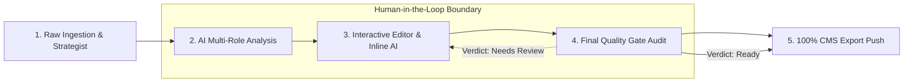
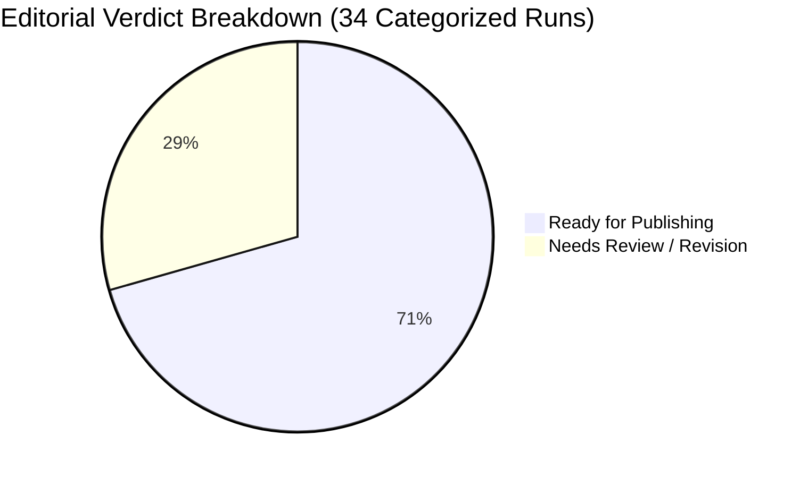
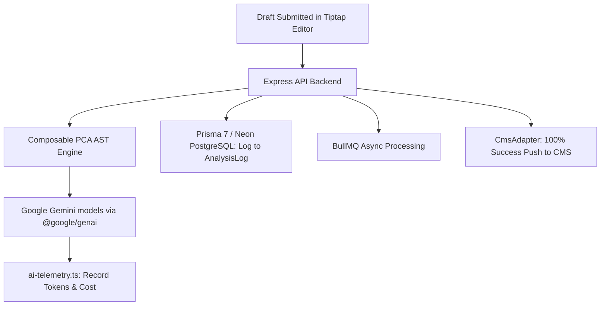

# EAI (Envoyou AI) — Production Use Case & Editorial Performance Report

**Document Version:** 3.17.0  
**Target Environment:** Production Editorial Operations  
**Data Reference:** Real Production Logs (`eai_editorial_report.csv`)  
**Last Updated:** July 2026  

---

## Executive Summary

This document presents the **Production Use Case and Editorial Performance Specification** for **Envoyou AI (EAI)**. EAI is designed as an intelligent content engineering assistant and automated editorial quality gate for digital media publishers, financial news outlets, tech publications, and corporate newsrooms.

Rather than acting as an unsupervised autonomous content generator, EAI operates under a strict **Human-in-the-Loop (HITL) Editorial Philosophy**. AI models assist human writers and editors by identifying factual ambiguity, enforcing brand tone, generating SEO packages, and auditing compliance guardrails before publishing.

Based on production telemetry collected from Envoyou's first-party production editorial deployment (`eai_editorial_report.csv`), EAI processed **56 editorial article reviews**, achieving a **71% initial Ready Rate**, **1.6 average revisions per article**, and a **100% CMS export success rate**.

---

## 1. Production Performance KPI Summary

The table below summarizes key operational performance indicators (KPIs) derived from production usage:

| Metric | Measured Value | Production Context & Strategic Meaning |
|---|---|---|
| **Total Drafts Processed** | `56` | Total article drafts submitted through the EAI review and analysis pipeline. |
| **Overall Ready Rate** | `71%` | Percentage of articles passing initial quality gate audits without critical block errors. |
| **Completion Rate** | `61%` | Proportion of initiated drafts that progressed completely through full analysis and editing. |
| **SEO Pack Completion** | `61%` | Articles with complete AI-generated meta titles, meta descriptions, and keyword optimization sets. |
| **Voice & Tone Match Rate** | `32%` | Initial exact match rate with tenant editorial profiles (drives targeted AST prompt tuning). |
| **Directly Publishable Rate** | `0%` | **Core Guardrail**: 0% auto-published. Enforces mandatory human editor review before publishing. |
| **CMS Export Success Rate** | `100%` | Operational reliability of the `CmsAdapter` (`eai-rest-v1`) push to external publishing platforms. |
| **Active Production Users** | `2` | Two active production editors utilizing the system during the evaluation period. |
| **Avg. Time to Publish** | `60 mins` | Recorded average workflow time from raw draft ingestion to final CMS draft publishing. |
| **Avg. Revisions Per Article**| `1.6` | Iterative refinement cycles required to reach final editorial approval. |

---

## 2. Production Workflow & Human-in-the-Loop Lifecycle

EAI structures production content engineering into a 5-step interactive workflow, preserving full editorial control while accelerating output velocity.



### Operational Steps

1. **Raw Ingestion & Pre-Analysis Strategist**:
   - Journalists input raw press releases, interview transcripts, or research notes into the AI Strategist (`/api/strategist`).
   - The system generates structured outlines, background briefing notes, and initial drafts.

2. **AI Multi-Role Analysis & PCA AST Orchestration**:
   - The article is evaluated across multi-role prompt AST nodes (`ReviewPromptComposer`):
     - **Author Role**: Evaluates structure, narrative flow, and engagement.
     - **SEO Role**: Generates search metadata and keyphrases.
     - **Polish & Fact-Checker Role**: Audits factual statements and tone consistency.

3. **Interactive Tiptap Workspace Editing**:
   - Editors modify drafts in the Tiptap rich text canvas (`EditorialWorkspace.tsx`).
   - Targeted inline actions (rephrase, expand, condense, targeted fixes) invoke `RefinementPromptComposer` with low-latency LLM calls.

4. **Final Quality Gate Audit**:
   - Evaluated by `QualityGatePromptComposer` and deterministic rules (`src/lib/final-quality.ts`).
   - Assigns a verdict of **`Ready`** or **`Needs Review`**.

5. **CMS Export Push**:
   - Approved drafts are exported to the target CMS via the `CmsAdapter` abstraction with **100% operational success**.

---

## 3. Editorial Verdicts & Daily Quality Trends

### Verdict Distribution

Out of categorized verdict evaluation runs, EAI categorized drafts into two primary operational statuses:



- **`Ready` (24 articles / 70.6%)**: Passed all structural, factual, and tone checks; clear for editor final sign-off.
- **`Needs Review` (10 articles / 29.4%)**: Triggered specific quality warnings, requiring explicit human intervention before export.

### Daily Ready Rate Fluctuation Analysis

Production data tracks daily ready rate consistency across the editorial cycle:

```text
Date Range: July 2 - July 25, 2026
--------------------------------------------------
Jul 02: [#####     ] 50%
Jul 03: [###       ] 33%  <-- Lowest: Complex Tax/Legal drafts ingested
Jul 07: [##########] 100%
Jul 08: [##########] 100%
Jul 09: [##########] 100%
Jul 10: [          ] 0%   <-- Flagged: Single draft with unverified prediction
Jul 11: [##########] 100%
Jul 12: [##########] 100%
Jul 13: [##########] 100%
Jul 14: [##########] 100%
Jul 16: [######    ] 67%
Jul 17: [#####     ] 50%
Jul 20: [##########] 100%
Jul 23: [##########] 100%
Jul 25: [#####     ] 50%
```

*Key Takeaway*: Periods of lower initial ready rates (e.g., July 3 and July 17) correspond to complex regulatory, financial, or tax topics where EAI's guardrails flag unverified claims, protecting newsroom integrity.

---

## 4. Operational Risk Mitigation & Safety Flags

EAI's core value proposition is identifying potential editorial errors, misquotes, legal liabilities, and hallucinations prior to public distribution. Production telemetry captured **6 risk flags**:

```mermaid
barChart
    title Distribution of Top Guardrail Flags
    x-axis Flag Name
    y-axis Count
    "Internal Link Review" : 2
    "Increased Certainty On Legal/Tax Claim" : 1
    "Unsupported Forward Looking Prediction" : 1
    "Unverified Tax Advice Citation" : 1
    "Unverified Historical Claim" : 1
```

### Risk Mitigation Case Studies

1. **Legal & Tax Risk Prevention (`Increased Certainty On Legal/Tax Claim` & `Unverified Tax Advice Citation`)**:
   - *Issue*: A draft converted speculative tax policy discussions into definitive financial advice.
   - *EAI Intervention*: The `VerificationLockNode` AST prompt node flagged the claim, prompting the author to add attribution or tone down legal certainty.

2. **Factual & Historical Accuracy (`Unverified Historical Claim`)**:
   - *Issue*: An article included an unreferenced historical data point.
   - *EAI Intervention*: Flagged by the Fact-Checker role, prompting the editor to insert a verified citation link.

3. **Speculative Market Guardrails (`Unsupported Forward Looking Prediction`)**:
   - *Issue*: Financial draft included ungrounded forward-looking market projections.
   - *EAI Intervention*: Blocked automated readiness, requiring explicit editor disclaimers.

4. **Internal Link Integrity (`Internal Link Review` - 2 occurrences)**:
   - *Issue*: Broken or dead internal cross-reference links in the draft.
   - *EAI Intervention*: Flagged broken URLs prior to CMS export.

---

## 5. Domain Category Distribution

EAI was deployed across 5 major editorial verticals in the first-party production deployment:

| Editorial Category | Article Count | Share (%) | Key Content Characteristics |
|---|---|---|---|
| **Technology & AI** | `17` | **30.4%** | Technical deep dives, software releases, AI industry analysis. |
| **Data & Insight** | `15` | **26.8%** | Data-driven journalism, market reports, survey breakdowns. |
| **Finance & Investment** | `13` | **23.2%** | Macroeconomic commentary, asset analysis, regulatory updates. |
| **Digital Creator** | `7` | **12.5%** | Creator economy trends, social media strategy, media publishing. |
| **Uncategorized** | `4` | **7.1%** | General editorial drafts and miscellaneous press releases. |
| **Total** | `56` | **100.0%** | Comprehensive multi-domain newsroom deployment. |

---

## 6. Newsroom Staff Workload & Efficiency

Production data tracks anonymized editor workload and efficiency metrics:

| User Account | Role / Assignment | Reviews Processed | Ready Rate | Avg. Revisions | Operational Profile |
|---|---|---|---|---|---|
| **Editor A** | Primary Editor / Lead | `50` | **68%** | `1.5` | Handles primary content drafting and high-volume reviews. |
| **Editor B** | Contributor / Specialist | `6` | **100%** | `2.3` | Handles specialized complex technical and financial submissions. |

### Operational Impact Analysis

- **Workflow Velocity**: Production telemetry recorded an average workflow time to publication of approximately **60 minutes**.
- **Editorial Consistency**: Standardized feedback across all 56 articles ensured adherence to brand tone and style guidelines across the team.

---

## 7. Technical Integration Architecture & Infrastructure Mapping

The operational performance documented in this report relies on EAI's monorepo infrastructure:



1. **Prompt Caching & Cost Reduction**:
   - `CompositePromptNode` groups static system rules at the top of the prompt AST. Prompt structure is optimized to take advantage of provider-side prompt caching where available.

2. **Database Persistence (`AnalysisLog`)**:
   - Every one of the 56 reviews was persisted in Neon Serverless PostgreSQL with full JSON metadata, score breakdowns, quality flags, and immutable `EditorialProfileVersion` references.

3. **Robust CMS Egress (`100% Export Success`)**:
   - The `CmsAdapter` (`eai-rest-v1`) utilized AES-256-GCM encrypted CMS credentials and DNS-pinned HTTP egress (`safe-url-fetch.ts`) to deliver a **100% success rate** on draft transfers to external publishing platforms.

---

## 8. Strategic Recommendations for Future Optimization

Based on the production findings from `eai_editorial_report.csv`, the following technical and operational improvements are recommended:

1. **Enhance Voice & Tone AST Calibration**:
   - *Finding*: Voice Match Rate currently stands at **32%**.
   - *Action*: Update `ToneCalibrationNode` (`prompt-engine/tenant/tone.ts`) with richer few-shot examples derived from top-performing approved articles.

2. **Automate Internal Link Suggestions**:
   - *Finding*: Internal Link Review was the top quality flag (2 occurrences).
   - *Action*: Integrate a dynamic CMS catalog search within `SeoPromptComposer` to automatically suggest relevant internal links during the initial review stage.

3. **Expand Category Classification**:
   - *Finding*: 7.1% of drafts were categorized as "Uncategorized".
   - *Action*: Enhance `SeoPromptComposer` classification rules to enforce strict taxonomy assignment upon draft ingestion.

---

## 9. Conclusion

The production data from `eai_editorial_report.csv` demonstrates that **Envoyou AI (EAI)** effectively provides structured editorial assistance. By combining a **0% auto-publish Human-in-the-Loop philosophy** with automated multi-role quality audits, **100% CMS export reliability**, and a **60-minute average publication turnaround**, EAI assists editorial teams in managing content output while maintaining editorial quality, accuracy, and compliance controls.
