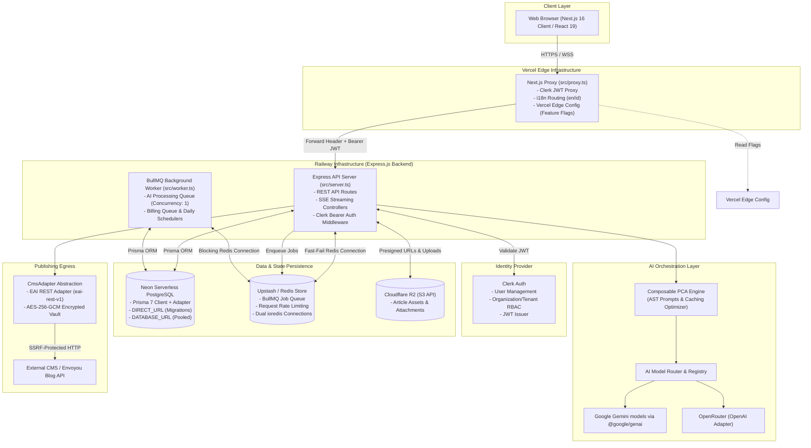
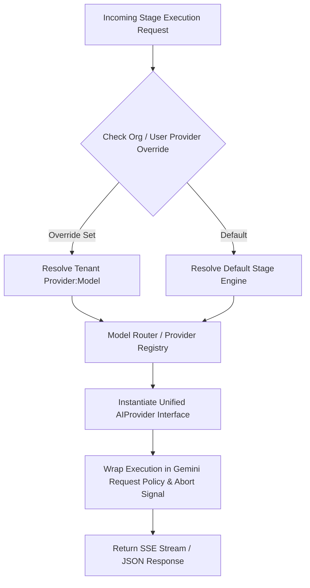
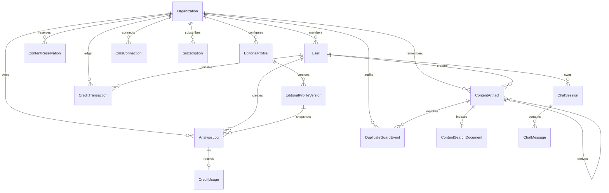
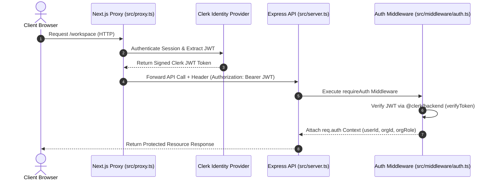

# EAI (Envoyou AI) — Reference Architecture Specification

**Document Version:** 3.17.0  
**Target Environment:** Production (Vercel + Railway + Neon + Upstash Redis)  
**Last Updated:** July 2026  

---

## Executive Summary

**Envoyou AI (EAI)** is an intelligent content engineering and automated editorial orchestration platform. Designed for digital newsrooms, media publications, and brand editorial teams, EAI transforms raw research, unstructured notes, and draft articles into publication-ready, brand-aligned content.

The platform operates as a modern monorepo powered by **Turborepo**, separating concerns into a **Next.js 16 / React 19** frontend application deployed on Vercel and an **Express.js / Node.js** API server with **BullMQ** background workers deployed on Railway. Data persistence is managed via **Neon Serverless PostgreSQL** through **Prisma 7**, while stateful queuing and rate-limiting are backed by **Redis (Upstash/ioredis)**. AI orchestration is powered by a multi-provider model routing layer (primarily leveraging Google Gemini models via `@google/genai`) governed by a formal **Composable Prompt Component Architecture (PCA)**.

---

## 1. Monorepo Overview & High-Level System Topology

EAI follows a strict monorepo design pattern managed by Turborepo and `npm` workspaces. 

### Monorepo Structure

```text
EAI Monorepo Root
├── apps/
│   ├── frontend/         # Next.js 16 App Router (Vercel Deployment)
│   └── backend/          # Express.js API & BullMQ Worker (Railway Deployment)
├── packages/
│   └── shared/           # @eai/shared domain schemas, types, and server-only utilities
├── docs/                 # System architecture, migration, and compliance documentation
├── turbo.json            # Turborepo task pipeline configuration
└── package.json          # Workspace root manifest
```

### High-Level System Architecture Diagram



---

## 2. Frontend Architecture (Next.js 16 & React 19)

The frontend is located in `apps/frontend` and built on **Next.js 16.2.11 (App Router)** and **React 19.2.4**.

### Key Architectural Characteristics

1. **Proxy Layer (`src/proxy.ts`)**:
   - Replaces the traditional `middleware.ts` to manage request intercepting.
   - Evaluates Clerk session tokens, enforces locale-based routing (`next-intl` handling `/en` and `/id` prefixes), and injects feature flags from **Vercel Edge Config**.
   - Propagates Clerk JWT bearer tokens to the backend API (`NEXT_PUBLIC_API_URL`).

2. **Rich Text Editorial Workspace (`EditorialWorkspace.tsx`)**:
   - Built around **Tiptap 3.27.1** (`@tiptap/react`, `@tiptap/pm`, `tiptap-markdown`).
   - Supports bi-directional conversion between ProseMirror DOM trees and Markdown formats.
   - Decomposes workspace state through custom orchestration hooks (`useEditorialWorkspace`, `useContentStrategist`, `useStrategistChat`).

3. **Design System & Primitive Boundaries**:
   - Styled using **Tailwind CSS v4** (`@tailwindcss/postcss`) combined with canonical CSS design tokens (`var(--surface-1)`, `var(--primary)`, `var(--surface-2)`).
   - Component primitives built with **shadcn/ui** (`base-nova` style) and **Base UI** (`@base-ui/react` v1.5.0).
   - **Enforced UI Rules**:
     - Raw `<button>` elements are strictly forbidden in feature code; all buttons consume the canonical `<Button>` primitive from `@/components/ui/button`.
     - Standard browser `<select>` tags are banned in favor of `<Select>`, which dynamically renders as a mobile swipeable bottom sheet on screens $\le 768\text{px}$.
     - Tooltips use `<TooltipTrigger render={...}>` to ensure compatibility with Base UI (no `asChild`).
     - Dropdowns inside scrollable table containers are rendered through portals (`<Menu.Portal>`) to prevent clipping.

4. **Streaming & Lifecycle Resiliency**:
   - Connections to AI endpoints rely on `fetchWithTimeout` and `readWithTimeout` (`lib/fetch-utils.ts` & `lib/stream-utils.ts`).
   - Listens to component unmounts and explicit user cancellations to invoke `AbortController.abort()`, releasing backend resources immediately.

---

## 3. Backend & AI Orchestration Layer (Express.js & Composable PCA)

The backend service is located in `apps/backend` and runs an **Express.js 4** server bundled via `tsup`.

### Multi-Provider AI Architecture

EAI decouples AI execution from vendor lock-in through a unified provider registry (`src/lib/ai/providers/`):

- **`GeminiProvider`**: Primary intelligence engine wrapping `@google/genai` (supporting Google Gemini models with thinking configurations).
- **`OpenRouterProvider`**: OpenAI-compatible client wrapper (`openai` SDK) targeting OpenRouter endpoint models.

The **Model Router** (`src/lib/ai/model-router.ts`) dynamically resolves model parameters, token limits, and organization-level provider overrides (`aiProviderOverride`).



### Composable Prompt Component Architecture (PCA)

Prompts in EAI are constructed dynamically using an Abstract Syntax Tree (AST) framework under `src/lib/ai/prompt-engine/`:

1. **AST Node Layers**:
   - **Static Core Nodes (`prompt-engine/core/`)**: Universal system guardrails and platform rules (`EditorialMissionNode`, `LanguagePolicyNode`, `MarkdownRulesNode`, `VerificationLockNode`, `TemporalContextNode`, `OutputSchemaNode`).
   - **Dynamic Tenant Nodes (`prompt-engine/tenant/`)**: Organization-specific profile rules (`BrandIdentityNode`, `ToneCalibrationNode`).

2. **Stage Composers**:
   - Specialized stage composers (`SeoPromptComposer`, `ReviewPromptComposer`, `RewritePromptComposer`, `RefinementPromptComposer`, `QualityGatePromptComposer`, `StrategistPromptComposer`, `ContentMemoryClassifierComposer`) orchestrate AST nodes into a unified `CompositePromptNode`.

3. **Gemini Prompt Caching Optimization**:
   - `CompositePromptNode` strictly enforces AST node order by placing static Core nodes at the beginning of the prompt and appending dynamic Tenant/Article context at the end. Prompt structure is optimized to take advantage of provider-side prompt caching where available.

4. **Security Boundaries & Input Isolation**:
   - Context is injected within explicit `<workspace_context>` XML blocks while dynamic system rules reside in `<agent_instruction>` blocks, mitigating prompt injection vulnerabilities.

---

## 4. Redis & BullMQ Background Job Architecture

Stateful queues, background job scheduling, and distributed HTTP rate-limiting are powered by **Redis** and **BullMQ 5.79.1**.

### Dual Redis Client Strategy (`src/lib/redis.ts`)

To ensure background workers never starve API server threads, EAI maintains two separate `ioredis` client configurations:

```typescript
// 1. BullMQ Worker Client: Unlimited command retries for long-lived blocking commands
export const redisConnection = new Redis(redisUrl, {
  maxRetriesPerRequest: null,
});

// 2. HTTP Request Client: Fast-failing connection for API rate-limiting
export const requestRedisConnection = new Redis(redisUrl, {
  connectTimeout: 2_000,
  enableOfflineQueue: false,
  lazyConnect: true,
  maxRetriesPerRequest: 1,
});
```

### Queue Topology & Workers (`src/lib/queue.ts` & `src/worker.ts`)

EAI operates two dedicated BullMQ queues:

1. **AI Processing Queue (`ai-processing-queue`)**:
   - Offloads long-running asynchronous content extraction and heavy batch processing.
   - **Concurrency**: Restricted to `1` worker thread per container to stay within RAM deployment constraints.
   - **Retry Policy**: 3 attempts with exponential backoff (2,000ms base delay).

2. **Billing & Operations Queue (`billing-queue`)**:
   - Handles subscription lifecycle and credit balance maintenance.
   - **Retry Policy**: 3 attempts with exponential backoff (5,000ms base delay).
   - **Repeatable Cron Schedulers**:
     - `0 1 * * *` (Daily at 01:00 AM): Triggers `monthly-credit-allocation` to refill monthly plan credits across active tenants.
     - `0 2 * * *` (Daily at 02:00 AM): Triggers `activate-queued-downgrade` to process scheduled plan downgrades upon subscription period expiration.

---

## 5. PostgreSQL Data Persistence (Neon & Prisma 7)

EAI relies on **Neon Serverless PostgreSQL** managed via **Prisma 7.9.0**.

### Prisma 7 Adapter Architecture (`prisma/prisma.config.ts`)

EAI adopts Prisma 7's configuration-based datasource architecture, separating direct migration endpoints from pooled production endpoints:

```typescript
// prisma.config.ts configuration pattern
datasource: { 
  url: process.env["DIRECT_URL"] || process.env["DATABASE_URL"] 
}
```

- **`DATABASE_URL`**: Connects through Neon's serverless connection pooler (`@prisma/adapter-neon` + `@neondatabase/serverless`) for high-concurrency API request handling.
- **`DIRECT_URL`**: Bypasses the pooler to execute direct schema migrations (`prisma migrate deploy`).

### Core Entity ER Diagram



### Domain Data Models

- **`User`**: Linked directly to Clerk via `id` (`user_...`). Tracks name, email, global role (`editor`, `admin`), balance, and trial allocations.
- **`Organization`**: Workspace multi-tenants mapped to Clerk Organizations (`clerkOrganizationId`). Stores custom publication names, domain settings, and provider overrides.
- **`AnalysisLog`**: CUID-indexed audit record storing AI feedback, quality scores, editorial verdicts, execution metadata (JSON), prompt configuration hashes, and exact `EditorialProfileVersion` references.
- **`ContentArtifact`**: Canonical organization-scoped registry for Blueprint, draft, analyzed, published, and imported content lifecycles. Source identifiers make writes idempotent and `rootArtifactId` links derived drafts to their originating artifact.
- **`ContentSearchDocument`**: Rebuildable retrieval projection containing normalized collaboration-safe search context plus a model/source-versioned `vector(768)` embedding. Full-text, trigram, and cosine candidates are joined only within the active internal `organizationId`; stale vectors are excluded until the bounded BullMQ indexer refreshes them.
- **`ContentReservation` & `DuplicateGuardEvent`**: Short-lived request claims prevent concurrent duplicate generation, while audit events retain deterministic/hybrid verdicts, classifier model/latency, and user outcomes for future threshold calibration. The ambiguity classifier cannot create an exact verdict or blocking action.
- **`CmsConnection`**: Stores external CMS endpoint targets. Sensitive API keys are encrypted at rest using AES-256-GCM.
- **`CreditTransaction` & `CreditUsage`**: Strict transactional credit accounting ledger enforcing idempotency keys (`idempotencyKey`), distinct credit buckets (`trial`, `subscription`, `addon`), and manual admin adjustment audit trails.
- **`AuditLog`**: Immutable platform audit log capturing administrative actions (credit overrides, user bans, feature flag toggles).

---

## 6. Authentication & Security Architecture

EAI implements defense-in-depth security across authentication, authorization, and network egress boundaries.

### Authentication Flow (Clerk Auth)



### Security Protocols

1. **Token Authentication (`src/middleware/auth.ts`)**:
   - Routes under `/api/*` are guarded by `requireAuth`.
   - Validates Bearer JWT tokens against `CLERK_SECRET_KEY` using `@clerk/backend`.
   - Extracts organization membership (`x-clerk-org-id`, `x-clerk-org-role`) directly from request headers or verified token claims.

2. **Owner-Only Administrative Gating**:
   - High-privilege administrative endpoints (`/api/admin/*`) enforce system owner authorization via `isOwnerUser` (`@eai/shared/server`), validating user IDs against the `OWNER_USER_IDS` environment variable.

3. **Credential Vault (`src/lib/credential-vault.ts`)**:
   - Third-party CMS keys and tokens are encrypted prior to database insertion using AES-256-GCM authenticated encryption derived from `CMS_CREDENTIALS_ENCRYPTION_KEY`. Plaintext credentials are never written to disk or logs.

4. **SSRF & Outbound Network Egress Guardrails (`src/lib/safe-url-fetch.ts`)**:
   - Outbound HTTP requests targeting external URLs (e.g., URL content scraping or CMS validation) must pass through `fetchPublicUrl`.
   - **DNS-Pinning & IP Whitelisting**: Resolves domain hostnames and verifies target IPs before opening sockets. Strictly blocks private/internal IP ranges (IPv4 `10.0.0.0/8`, `127.0.0.0/8`, `172.16.0.0/12`, `192.168.0.0/16`, `169.254.0.0/16`, and IPv6 equivalents `::1`, `fc00::/7`, `fe80::/10`).
   - **Port & Size Restrictions**: Restricts outbound egress to ports `80` and `443`, enforcing a response body limit of 2MB (`DEFAULT_MAX_RESPONSE_BYTES`).

---

## 7. CMS Integration Architecture

EAI features a pluggable, decoupled CMS Integration framework located in `src/lib/cms-adapter.ts`.

### Interface Specification

All CMS integrations implement the `CmsAdapter` contract:

```typescript
export interface CmsAdapter {
  key: string;
  displayName: string;
  listPublishedPosts(limit?: number): Promise<CmsPublishedPost[]>;
  exportDraft(payload: CmsDraftPayload): Promise<CmsExportResult>;
}
```

### Adapter Implementations

1. **`EaiRestAdapter` (`eai-rest-v1`)**:
   - Standard HTTP REST adapter connecting EAI to modern headless CMS instances (such as Next.js blogs, WordPress with EAI webhook plugins, or custom REST targets).
   - Transmits publication drafts to `/api/admin/posts/import-from-eai` using a shared header key (`X-EAI-Secret`).
   - Includes automatic transient retry handling (`[8000ms, 5000ms]` deadlines).

2. **Dynamic Organization Resolution (`resolveCmsAdapterForProfile`)**:
   - Resolves the active tenant's `CmsConnection` record from PostgreSQL.
   - Decrypts connection secrets on demand using the Credential Vault and returns a scoped `CmsAdapter` instance.

---

## 8. Health Checks, Monitoring & Telemetry

EAI provides 3-tiered health diagnostic checks (`src/routes/health.ts`) and active telemetry tracking.

### Health Check Hierarchy

```mermaid
graph TD
    HealthEndpoint["Health Check Endpoints"] --> ShallowCheck["1. Shallow Check GET /health"]
    HealthEndpoint --> DeepCheck["2. Deep Infra Check GET /api/health"]
    HealthEndpoint --> JourneyCheck["3. User Journey Check GET /api/health/journey"]

    ShallowCheck --> ShallowResp["Returns HTTP 200 OK<br>(Uptime, Version, Timestamp)"]

    DeepCheck --> InfraParallel["Probe 12 Subsystems in Parallel (3s Timeout)"]
    InfraParallel --> DBCheck[Database / Neon]
    InfraParallel --> RedisCheck[Redis Connection]
    InfraParallel --> WorkerCheck[BullMQ Worker]
    InfraParallel --> AuthCheck[Clerk API]
    InfraParallel --> StorageCheck[Cloudflare R2]
    InfraParallel --> AIChecks[Gemini / OpenRouter APIs]
    InfraParallel --> BillingChecks[Midtrans / Email / Edge Config]

    DeepCheck --> DeepEval{Critical System Failed?}
    DeepEval -- Yes --> HTTP503["Return HTTP 503 (Unhealthy)"]
    DeepEval -- No (Degraded Non-Critical) --> HTTP200Degraded["Return HTTP 200 (Degraded)"]

    JourneyCheck --> JourneyParallel["Probe 16 Workflows Across 7 Journey Steps"]
    JourneyParallel --> Step0[Step 0: Onboarding]
    JourneyParallel --> Step1[Step 1: Strategist & Pre-Analysis]
    JourneyParallel --> Step2[Step 2: Workspace Setup]
    JourneyParallel --> Step3[Step 3: AI Analysis]
    JourneyParallel --> Step4[Step 4: In-Editor AI Actions]
    JourneyParallel --> Step5[Step 5: Analysis History]
    JourneyParallel --> Step6[Step 6: CMS Export]
    JourneyParallel --> Step7[Step 7: Subscription & Checkout]
```



### Telemetry & Error Tracking

- **Application Telemetry**: Frontend and backend errors are captured and reported via **Sentry 10** (`@sentry/nextjs`).
- **AI Telemetry (`src/lib/ai-telemetry.ts`)**: Every AI invocation logs prompt tokens, completion tokens, calculated cost estimates ($USD$), model names, and execution stage latencies to the `AnalysisLog` database model for usage analytics and auditing.

---

## 9. Failure Handling, Retries, Timeouts & Cancellation

To maintain platform stability during provider outages or traffic spikes, EAI enforces structured fault tolerance policies.

### Summary of Fault Tolerance Policies

| Subsystem | Failure Scenario | Policy & Mitigation Strategy | Primary Source File |
|---|---|---|---|
| **Gemini AI API** | HTTP 429 (Rate Limit) / HTTP 503 (Unavailable) | **Flex Tier Policy**: Retries transient capacity errors with exponential backoff (base delay 5s, up to 5 attempts). Standard HTTP 4xx/5xx errors fail fast. | `src/lib/ai/gemini-request-policy.ts` |
| **HTTP Outbound Requests** | Slow downstream API / Hangs | **`fetchWithTimeout`**: Enforces a strict 15,000ms deadline. Automatically aborts request and throws `OutboundRequestTimeoutError`. | `src/lib/fetch-with-timeout.ts` |
| **Client Disconnections** | Browser tab closed during active SSE AI generation | **`bindResponseAbort`**: Listens to Express response `close` events and immediately signals `AbortController.abort()` to terminate active LLM API execution. | `src/lib/request-abort.ts` |
| **PostgreSQL Transactions** | Concurrent serializable isolation conflict / deadlock | **`withSerializableTransaction`**: Automatically retries serializable Prisma transactions with randomized jitter backoff. | `src/lib/serializable-transaction.ts` |
| **BullMQ Workers** | Job handler exception | **Exponential Backoff**: AI Queue retries failed jobs 3 times with a 2,000ms delay; Billing Queue retries 3 times with a 5,000ms delay. Failed job details preserved for analysis (`removeOnFail: 100`). | `src/lib/queue.ts` |
| **Redis Connectivity** | Transient connection drop on HTTP path | **Dual Connection Separation**: HTTP path uses `requestRedisConnection` with 2,000ms timeout and `enableOfflineQueue: false` to fail fast without hanging client HTTP requests. | `src/lib/redis.ts` |
| **Outbound Web Scraping** | Malicious / Private IP target | **SSRF Prevention**: `validatePublicHttpUrl` checks DNS resolution against IPv4/IPv6 private ranges and limits response size to 2MB. | `src/lib/safe-url-fetch.ts` |

---

## 10. Conclusion

The **Envoyou AI (EAI)** reference architecture balances AI capabilities with structured engineering standards. By pairing Next.js 16 and React 19 on the frontend with an Express.js and BullMQ backend, Neon Serverless PostgreSQL, Upstash Redis, and the Composable Prompt Component Architecture, EAI provides efficient prompt caching, pluggable CMS integration, and resilient operation under failure conditions.
