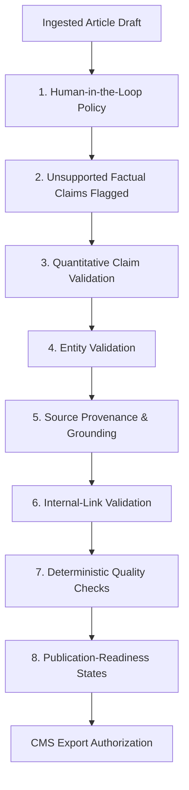
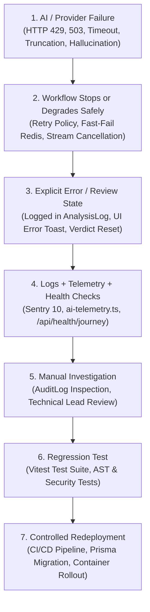

# EAI (Envoyou AI) — Responsible AI Governance Specification

**Document Version:** 3.17.0  
**Target Environment:** Production Operations & Editorial Governance  
**Governance Scope:** AI Safety, Editorial Ethics, Compliance & Risk Mitigation  
**Last Updated:** July 2026  

---

## Executive Summary

As an intelligent content engineering platform, **Envoyou AI (EAI)** operates under a structured **Responsible AI Governance Framework**. Designed for digital newsrooms, media organizations, and corporate editorial teams, EAI enforces technical guardrails, deterministic compliance checks, and mandatory human oversight. The system is designed to reduce the risk of unsupported or unverified AI-generated content reaching publication through deterministic checks and mandatory human review.

This document formalizes the ownership model, technical control mechanisms, and escalation procedures governing AI usage across the EAI monorepo.

---

## 1. Responsible AI Ownership

Governance and operational accountability for AI deployment within EAI are assigned directly to the **Founder / Technical Lead**.

### Core Governance Responsibilities

- **System Architecture & AST Guardrails**: Direct oversight of the Composable Prompt Component Architecture (PCA), ensuring static platform AST nodes (`FactsNode`, `VerificationLockNode`, `MarkdownRulesNode`) enforce factual accuracy and safety rules.
- **Provider & Model Configuration**: Management of multi-provider AI configurations (`GeminiProvider`, `OpenRouterProvider`), model routing policies, and fallback tiers.
- **Credential & Access Security**: Sole authority over sensitive environment secrets, API keys, and AES-256-GCM encryption keys (`CMS_CREDENTIALS_ENCRYPTION_KEY`).
- **Incident Response & Policy Enforcement**: Final decision-making authority during AI provider outages, model behavior anomalies, or safety escalations.

---

## 2. Technical Control Mechanisms

EAI implements an 8-pillar control architecture embedded directly into the frontend user interface, backend API pipelines, and prompt engine AST.

### Detailed Control Specifications

#### 1. Human-in-the-Loop (HITL) Policy
- **Codebase Anchor**: `apps/frontend/src/EditorialWorkspace.tsx`, `FeedbackPanel.tsx`, `apps/backend/src/middleware/auth.ts`.
- **Implementation**: EAI enforces a strict **0% Direct Auto-Publishing Policy** (`Directly publishable: 0%` in production metrics). All AI outputs—including full rewrites, targeted fixes, and SEO packages—are delivered as draft suggestions within the Tiptap rich text editor. Final publishing rights remain strictly with authenticated human editors.

#### 2. Unsupported Factual Claims Flagged
- **Codebase Anchor**: `src/lib/ai/prompt-engine/core/facts.ts` (`FactsNode`), `ReviewPromptComposer`.
- **Implementation**: Articles are scanned for unverified claims, speculative market predictions, or uncited historical statements. If a claim lacks supporting context inside `<workspace_context>`, the engine flags the item (e.g., `Unverified Historical Claim`, `Unsupported Forward Looking Prediction`), blocking automated readiness.

#### 3. Quantitative Claim Validation
- **Codebase Anchor**: `src/lib/ai/prompt-engine/core/rules.ts` (`VerificationLockNode`), `QualityGatePromptComposer`.
- **Implementation**: Numerical values, percentages, tax rates, monetary statistics, and financial projections undergo targeted scrutiny. The AI engine is instructed to avoid extrapolating or exaggerating statistical certainty without explicit source data (mitigating risks such as `Increased Certainty On Legal/Tax Claim`).

#### 4. Entity Validation
- **Codebase Anchor**: `src/lib/ai/prompt-engine/tenant/profile.ts` (`BrandIdentityNode`), `workspace-context.ts`.
- **Implementation**: Validates proper nouns, executive names, corporate entities, product titles, and regulatory frameworks against the tenant's active `EditorialProfileVersion` to assist in preventing name misspelling or improper organizational attribution.

#### 5. Source Provenance & Grounding
- **Codebase Anchor**: `src/lib/ai/workspace-context.ts` (`composeWorkspaceContext`), `src/routes/strategist/utils/`.
- **Implementation**: Incoming research notes, URLs, and reference attachments are wrapped in strict `<workspace_context>` XML tags. System instructions explicitly instruct models to distinguish between verified source context and general baseline knowledge, mitigating prompt injection vulnerabilities.

#### 6. Internal-Link Validation
- **Codebase Anchor**: `src/lib/final-quality.ts`, `src/routes/analyze/utils/`.
- **Implementation**: Automatically parses Markdown hyperlink syntax (`[label](url)`) within draft articles. Internal relative links and domain cross-references are audited for broken syntax or dead targets (generating `Internal Link Review` flags).

#### 7. Deterministic Quality Checks
- **Codebase Anchor**: `src/lib/final-quality.ts` (`detectMissingSentenceBoundaries`, `detectContentAfterReferences`), `src/lib/text-utils.ts` (`stripLeadingH1`).
- **Implementation**: Programmatic, non-LLM algorithmic rules run prior to and alongside AI evaluation stages. Ensures structural integrity (e.g., stripping duplicate `# H1` titles, verifying reference section formatting, ensuring proper sentence boundary punctuation) without relying solely on LLM probabilistic parsing.

#### 8. Publication-Readiness States
- **Codebase Anchor**: `schema.prisma` (`AnalysisLog`, `CmsConnection`), `src/lib/cms-adapter.ts`.
- **Implementation**: Every analysis run yields explicit state tags:
  - `AnalysisStatus`: `success` | `error`
  - `Verdict`: `Ready` (71% initial pass rate) | `Needs Review` (29% revision required) | `Revise`
  - `CmsConnectionStatus`: `pending` | `verified` | `failed`
  - Only drafts marked as `Ready` by human editors can trigger CMS export calls through `CmsAdapter`.

---

## 3. Incident Escalation & Recovery Flow

To manage operational stability and safety during provider outages, model degradation, or failure modes, EAI follows a formal 7-step escalation protocol.

### Operational Escalation Lifecycle

### Escalation Step Descriptions

1. **AI / Provider Failure**:
   - Triggered by transient LLM API rate limits (HTTP 429), provider unavailability (HTTP 503), outbound request timeouts (`fetchWithTimeout`), token output truncation (`TruncatedModelResponseError`), or client tab disconnections (`bindResponseAbort`).

2. **Workflow Stops or Degrades Safely**:
   - `withGeminiFlexRetry` applies exponential backoff for transient capacity errors (base delay 5s, max 5 retries) without standard tier fallback.
   - Non-retryable errors abort active streams immediately to mitigate token leakage.
   - Fast-failing Redis connection (`requestRedisConnection`) prevents API thread pool starvation.

3. **Explicit Error / Review State**:
   - Analysis state is set to `status = 'error'` in `AnalysisLog`, storing the exact `errorMessage`.
   - The frontend renders an inline error alert or toast via `sonner`, setting assistant placeholders to an explicit `error` or `cancelled` state.
   - Verdict defaults to `Needs Review`, preventing automated publication attempt.

4. **Logs + Telemetry + Health Checks**:
   - Exceptions are automatically reported to **Sentry 10** (`@sentry/nextjs`).
   - Token usage and latencies are recorded via `ai-telemetry.ts`.
   - The 3-tier health check system (`/health`, `/api/health` 12-subsystem probe, `/api/health/journey` 16-route workflow probe) alerts operators to subsystem degradation.

5. **Manual Investigation**:
   - The **Founder / Technical Lead** investigates the root cause using system audit logs (`AuditLog` model via `src/lib/audit.ts`) and developer AST diff inspection endpoints (`/api/prompt-inspector`).

6. **Regression Test**:
   - Fixes are verified locally using automated Vitest test suites (`npm run test -- --filter=backend`), testing AST node compilation (`prompt-engine.test.ts`), deterministic checks (`final-quality.ts`), and security bounds.

7. **Controlled Redeployment**:
   - Verified updates are deployed through GitHub CI/CD pipelines, Prisma database migration checks (`npx prisma migrate deploy`), and Railway zero-downtime container rollouts.

---

## 4. Summary & Compliance Commitment

By anchoring Responsible AI principles in codebase mechanics—including strict **Human-in-the-Loop boundaries**, multi-stage **PCA AST prompt controls**, **deterministic quality checks**, and automated **incident escalation pathways**—Envoyou AI aims to support editorial workflows while maintaining compliance controls, accuracy checks, and brand safety safeguards.
