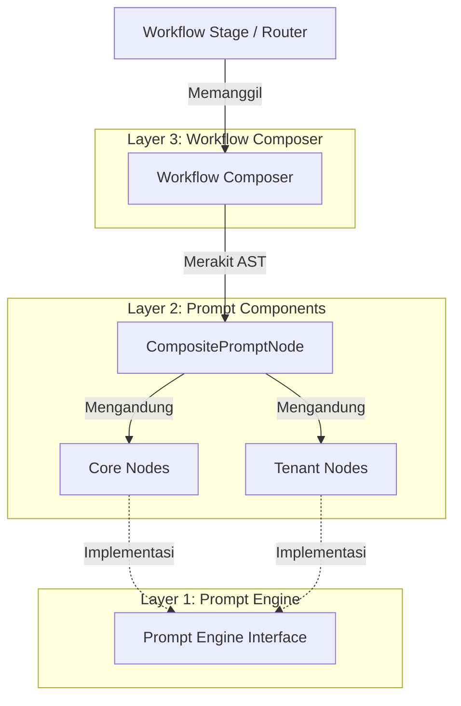

# Composable Prompt Component Architecture (PCA)

Dokumen ini mendokumentasikan desain arsitektur, filosofi, serta rencana masa depan untuk sistem manajemen instruksi model bahasa di **Envoyou AI (EAI)** menggunakan **Composable Prompt Component Architecture (PCA)**.

---

## 1. Latar Belakang & Motivasi

Pada banyak proyek berbasis Large Language Models (LLM), pengelolaan instruksi sistem (*system prompt*) sering kali berhenti pada salah satu dari tiga pendekatan konvensional berikut:
1.  **Monolithic Prompt (String Raksasa)**: Menempatkan ribuan baris instruksi ke dalam satu konstanta string tunggal. Sangat mudah dibuat di awal, namun sangat sulit dirawat (*maintenance nightmare*), rentan terhadap duplikasi, dan tidak memiliki struktur yang dapat diuji secara terisolasi.
2.  **Modular String (Concatenation)**: Memecah string menjadi beberapa fungsi pembantu kecil lalu menggabungkannya kembali menggunakan `.join('\n')`. Sedikit lebih baik, tetapi tetap saja hanya berupa kumpulan string tak bertipe tanpa aturan semantik yang jelas.
3.  **Ad-Hoc Prompting**: Menyusun dan merekatkan instruksi secara langsung (*inline*) pada masing-masing handler endpoint API. Hal ini memicu duplikasi logika, ketidakpastian format keluaran (JSON/XML), dan celah keamanan *prompt injection*.

**Composable PCA** memecahkan masalah ini dengan memperlakukan instruksi sistem bukan sebagai aset teks pasif, melainkan sebagai **Pohon Komponen Bertipe (Typed Prompt Component Tree)** yang dinamis, dapat diuji secara mandiri, memiliki pemisahan tanggung jawab yang jelas, serta mendukung optimalisasi *LLM prompt caching* secara otomatis.

---

## 2. Definisi Formal

> **Composable Prompt Component Architecture (PCA)** adalah pendekatan rekayasa perangkat lunak yang memodelkan *system prompt* sebagai sebuah pohon komponen bertipe (*typed prompt component tree*). Setiap komponen merepresentasikan satu tanggung jawab yang terisolasi—seperti misi editorial, aturan format markdown, profil brand tenant, atau skema output—yang kemudian dirakit oleh *workflow-specific composer* menjadi *prompt* akhir. Engine rendering bertugas menyerialisasikan pohon tersebut ke berbagai format (misalnya XML, Markdown, atau plain text) tanpa mengetahui logika bisnis dari tiap komponen.

---

## 3. Arsitektur Tiga Lapis (Three-Layer Architecture)

Desain PCA di EAI membagi tanggung jawab menjadi tiga lapisan utama:



### Lapisan 1: Prompt Engine (Shared Abstraction)
Berada di `@eai/shared/src/prompt-engine/`. Lapisan ini murni merupakan abstraksi tingkat dasar tanpa logika bisnis:
*   **`PromptNode`**: Antarmuka standar untuk setiap node pembentuk prompt.
*   **`RenderContext`**: Objek konteks bersama yang dikirimkan saat proses rendering berjalan (menyimpan target format, nama brand, dsb.).
*   **`CompositePromptNode`**: Komponen komposit yang menampung daftar anak node. Ia memiliki kecerdasan untuk mengelompokkan node statis terlebih dahulu guna mendukung *LLM prompt caching*.

### Lapisan 2: Prompt Components (Granular AST Nodes)
Berada di `apps/backend/src/lib/ai/prompt-engine/`. Terdiri dari kelas-kelas node terisolasi yang mengimplementasikan antarmuka `PromptNode`:
*   **`Core Nodes`** (Statis/Platform-wide):
    *   `EditorialMissionNode`: Visi dasar dan misi editorial platform.
    *   `LanguagePolicyNode`: Aturan rigid translasi dan bahasa output berdasarkan keinginan editor.
    *   `StrictnessConstraintNode`: Batasan toleransi kebebasan AI dalam berkreasi.
    *   `VerificationLockNode`: Penguncian verbatim teks di dalam tanda `[[VERIFICATION_LOCK]]`.
    *   `MarkdownRulesNode`: Larangan format ASCII table dan keharusan menggunakan GFM Markdown table.
    *   `VisualFormatSelectionPolicyNode`: Menjadikan prosa sebagai default dan memilih Mermaid, tabel, numbered list, atau bullet hanya ketika format tersebut meningkatkan pemahaman serta seluruh detailnya didukung sumber.
    *   `OutputSchemaNode`: Struktur format kontrak JSON yang wajib dipatuhi oleh LLM.
*   **`Tenant Nodes`** (Dinamis/Tenant-specific):
    *   `BrandIdentityNode`: Profil bisnis, target pembaca, dan kategori tenant.
    *   `ToneCalibrationNode`: Pola nada bahasa (*tone of voice*) yang boleh dan dilarang digunakan.

### Lapisan 3: Workflow Composer (Stage Assembly)
Berada di `apps/backend/src/lib/ai/prompt-engine/composer/`. Kelas-kelas komposer bertugas merakit AST Prompt sesuai dengan alur kerja tahapan (*stage*) pipeline EAI:
*   `SeoPromptComposer` (Tahap SEO)
*   `ReviewPromptComposer` (Tahap Review Editorial Multi-Role)
*   `RewritePromptComposer` (Tahap Rewrite Draf Akhir)
*   `RefinementPromptComposer` (Tahap Iterative Refinement & Targeted Fix)
*   `QualityGatePromptComposer` (Tahap Final Quality Gate)
*   `StrategistPromptComposer` (Tahap Draft & Outline Strategist)

---

## 4. Struktur Pohon Caching (Gemini Prompt Caching Optimization)

LLM modern seperti Google Gemini mendukung fitur *prompt caching* (Context Caching) untuk menekan biaya token input dan mempercepat waktu respon kueri. Namun, cache hanya akan aktif jika bagian awal (*prefix*) dari instruksi sistem bernilai statis (tidak berubah-ubah antar kueri).

`CompositePromptNode` secara cerdas menyelesaikan masalah ini dengan melakukan klasifikasi dan penyusunan urutan rendering secara otomatis:

```text
+-------------------------------------------------------------+
| RENDERED PROMPT AST                                         |
+-------------------------------------------------------------+
| [Core] EditorialMissionNode (Statis)                        |
| [Core] LanguagePolicyNode (Statis)                          |
| [Core] MarkdownRulesNode (Statis)                           |
| [Core] VerificationLockNode (Statis)                        |
| [Core] OutputSchemaNode (Statis)                            |
+-------------------------------------------------------------+
| <-- DYNAMIC CONTEXT & CONSTRAINTS SEPARATOR -->             |
+-------------------------------------------------------------+
| [Tenant] BrandIdentityNode (Dinamis per Workspace)          |
| [Tenant] ToneCalibrationNode (Dinamis per Workspace)        |
| [Context] ArticleMetadata & Date Context (Dinamis)           |
+-------------------------------------------------------------+
```

Dengan struktur di atas, seluruh porsi **Core Nodes** yang menempati ~80% ukuran total prompt dapat disimpan di dalam cache secara permanen oleh penyedia LLM. Hanya porsi kecil di bagian bawah yang diproses secara dinamis.

---

## 5. Implementasi Sub-sistem & Observabilitas (Sprint 4)

Pada Sprint 4, EAI memperkenalkan sub-sistem analisis dan observabilitas prompt dinamis:

```text
Composer ➔ AST ➔ Inspector ➔ Estimator ➔ Planner ➔ Optimizer ➔ Renderer ➔ Provider
```

### A. Prompt Token Estimator (`token-estimator.ts`)
*   **Estimasi Offline**: Mengkalkulasi ukuran token draf sistem menggunakan rasio bobot karakter (XML tags: ~3.5 karakter/token vs plain text: ~4.2 karakter/token).
*   **Pencacahan Online (Cached)**: Memanggil API online `countTokens` secara dinamis (didukung oleh `GeminiProvider`). Hasil pemanggilan dibungkus oleh memory cache menggunakan kunci hash SHA-256 dengan waktu kedaluwarsa (TTL) 30 menit untuk mereduksi latency jaringan.

### B. Prompt Cache Planner & Optimizer (`cache-planner.ts` & `cache-optimizer.ts`)
*   **Planner**: Melakukan *parsing* terhadap seluruh pohon AST komponen komposit, menghitung persentase efisiensi caching, dan memetakan segmen statis vs dinamis. Planner juga memverifikasi apakah ada node statis yang secara salah diletakkan di bawah/setelah node dinamis (*order violation*).
*   **Optimizer**: Beroperasi di atas laporan Planner dan parameter `cachePolicy` dari masing-masing provider untuk memberikan rekomendasi nyata (misalnya: deteksi jika prefix statis di bawah batas minimal provider—seperti 32,768 tokens pada Gemini—atau merekomendasikan penggabungan node duplikat).

### C. Prompt Inspector API (`routes/prompt-inspector.ts`)
*   **Boundary Akses Owner-Only**: Kedua endpoint mewajibkan Clerk authentication dan pemeriksaan `isOwnerUser`. Prompt Inspector bukan API inspeksi tenant yang dapat digunakan user biasa karena hasil render dapat memuat brand identity, tone, dan aturan editorial organisasi.
*   Menyediakan endpoint `POST /api/prompt-inspector` untuk audit visual prompt sebelum dikirimkan ke model LLM. Endpoint ini mengembalikan:
    *   `tree`: Struktur hierarki AST komponen prompt.
    *   `renderedPrompt`: Teks prompt utuh hasil render akhir.
    *   `tokenBreakdown`: Rincian alokasi token per masing-masing ID node (Mission, Brand, Facts, dsb.).
    *   `cacheAnalysis`: Laporan planner dan rekomendasi optimizer.
    *   `estimatedCost`: Perkiraan biaya input (cached & regular rate) dan output berdasarkan konfigurasi catalog harga model (`pricing.ts`).
*   Menyediakan endpoint `POST /api/prompt-inspector/diff` untuk membandingkan perbedaan token, status caching, serta visualisasi perubahan node breakdown antara dua konfigurasi (sangat berguna untuk debugging multi-tenant).
*   Mendukung simulasi multi-tenant produksi melalui parameter `workspaceId` opsional untuk memuat profil editorial dari database. Parameter ini hanya diproses setelah request lolos owner guard; caller non-owner menerima `403 Forbidden` dan tidak dapat membaca konfigurasi workspace lain.

### D. Formal Renderer, AST Serializer, & Pruning Optimizer (Sprint 5)
*   **`PromptNode` Priority Attribute**: Properti `priority?: number` pada antarmuka `PromptNode` (skala 1-5, dengan 1 = Mandatory/Utama dan 5 = Optional/Dapat Dipangkas).
*   **Prompt Renderer (`renderer.ts`)**: Kelas `PromptRenderer` menstandarkan format visual rendering, melakukan sanitasi baris baru (`\r\n` ➔ `\n`), menghapus spasi berlebih (`\n{3,}` ➔ `\n\n`), serta menjalankan pemeriksaan validasi kelengkapan penutupan tag XML jika format output adalah XML.
*   **AST Serializer (`serializer.ts`)**: Kelas `PromptSerializer` mendukung konversi dua arah (*bidirectional*) antara pohon AST `PromptNode` runtime dengan objek JSON polos (`SerializedPromptNode`) untuk kemudahan transfer wire/API maupun logging inspeksi.
*   **Pruning Node Optimizer (`pruning-optimizer.ts`)**: Kelas `PromptPruningOptimizer` secara otomatis memotong (*prune*) node AST opsional (prioritas 5 hingga 2) ketika estimasi token kueri melebihi budget limit token yang ditentukan. Node prioritas 1 (*Mandatory*) dijamin tidak pernah dipangkas.

---

## 6. Rencana Perluasan Masa Depan

### A. Hierarki Konteks Berjenjang (Scope-Leveling)
Untuk memfasilitasi integrasi SaaS multi-tenant dengan granularity tinggi, struktur penyimpanan komponen prompt akan diperluas menjadi folder-folder khusus dengan level pewarisan (*inheritance*) sebagai berikut:

```text
core/             # Kebijakan sistem global EAI
  └── tenant/     # Kebijakan kustom tingkat Tenant
        └── workspace/  # Profil operasional Workspace/Situs
              └── user/  # Preferensi individu jurnalis/editor
                    └── article/  # Draf tulisan & metadata spesifik artikel
```

Dengan hierarki ini, composer dapat memproses pewarisan aturan secara berjenjang dari atas ke bawah:
$$\text{Core Policy} \rightarrow \text{Tenant Brand} \rightarrow \text{Workspace Config} \rightarrow \text{User Preference} \rightarrow \text{Article Context}$$

### B. Topological Sort & Automagic Sorting
Mengubah deklarasi `PromptNode` agar mendukung relasi dependensi antarnode (`dependsOn`) untuk membolehkan composer menyusun tata letak node secara topologi otomatis (misal: `ToneCalibrationNode` harus diletakkan setelah `BrandIdentityNode` karena membutuhkan referensi industri brand).
