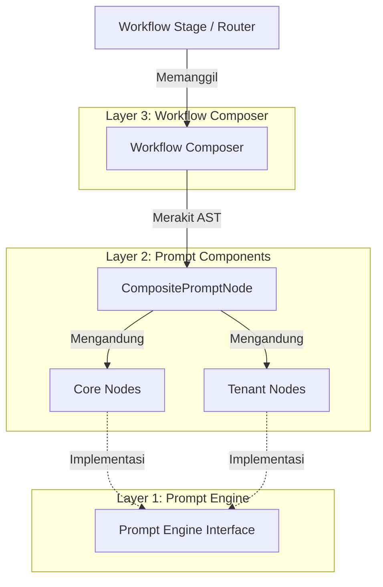

# Composable Prompt Component Architecture (PCA)

Dokumen ini mendokumentasikan desain arsitektur, filosofi, serta rencana masa depan untuk sistem manajemen instruksi model bahasa di **Envoyou AI (EAI)** menggunakan **Composable Prompt Component Architecture (PCA)**.

---

## 1. Latar Belakang & Motivasi

Pada banyak proyek berbasis Large Language Models (LLM), pengelolaan instruksi sistem (*system prompt*) sering kali berhenti pada salah satu dari tiga pendekatan konvensional berikut:
1.  **Monolithic Prompt (String Raksasa)**: Menempatkan ribuan baris instruksi ke dalam satu konstanta string tunggal. Sangat mudah dibuat di awal, namun sangat sulit dirawat (*maintenance nightmare*), rentan terhadap duplikasi, dan tidak memiliki struktur yang dapat diuji secara terisolasi.
2.  **Modular String (Concatenation)**: Memecah string menjadi beberapa fungsi pembantu kecil lalu menggabungkannya kembali menggunakan `.join('\n')`. Sedikit lebih baik, tetapi tetap saja hanya berupa kumpulan string tak bertipe tanpa aturan semantik yang jelas.
3.  **Ad-Hoc Prompting**: Menyusun dan merekatkan instruksi secara langsung (*inline*) pada masing-masing handler endpoint API. Hal ini memicu duplikasi logika, ketidakpastian format keluaran (JSON/XML), dan celah keamanan *prompt injection*.

**Composable PCA** memecahkan masalah ini dengan memperlakukan instruksi sistem bukan sebagai aset teks pasif, melainkan sebagai **Pohon Komponen Bertipe (Typed Prompt Component Tree)** yang dinamis, dapat diuji secara mandiri, memiliki pemisahan tanggung jawab yang jelas, serta mendukung optimalisasi *LLM prompt caching* secara otomatis.

---

## 2. Definisi Formal

> **Composable Prompt Component Architecture (PCA)** adalah pendekatan rekayasa perangkat lunak yang memodelkan *system prompt* sebagai sebuah pohon komponen bertipe (*typed prompt component tree*). Setiap komponen merepresentasikan satu tanggung jawab yang terisolasi—seperti misi editorial, aturan format markdown, profil brand tenant, atau skema output—yang kemudian dirakit oleh *workflow-specific composer* menjadi *prompt* akhir. Engine rendering bertugas menyerialisasikan pohon tersebut ke berbagai format (misalnya XML, Markdown, atau plain text) tanpa mengetahui logika bisnis dari tiap komponen.

---

## 3. Arsitektur Tiga Lapis (Three-Layer Architecture)

Desain PCA di EAI membagi tanggung jawab menjadi tiga lapisan utama:



### Lapisan 1: Prompt Engine (Shared Abstraction)
Berada di `@eai/shared/src/prompt-engine/`. Lapisan ini murni merupakan abstraksi tingkat dasar tanpa logika bisnis:
*   **`PromptNode`**: Antarmuka standar untuk setiap node pembentuk prompt.
*   **`RenderContext`**: Objek konteks bersama yang dikirimkan saat proses rendering berjalan (menyimpan target format, nama brand, dsb.).
*   **`CompositePromptNode`**: Komponen komposit yang menampung daftar anak node. Ia memiliki kecerdasan untuk mengelompokkan node statis terlebih dahulu guna mendukung *LLM prompt caching*.

### Lapisan 2: Prompt Components (Granular AST Nodes)
Berada di `apps/backend/src/lib/ai/prompt-engine/`. Terdiri dari kelas-kelas node terisolasi yang mengimplementasikan antarmuka `PromptNode`:
*   **`Core Nodes`** (Statis/Platform-wide):
    *   `EditorialMissionNode`: Visi dasar dan misi editorial platform.
    *   `LanguagePolicyNode`: Aturan rigid translasi dan bahasa output berdasarkan keinginan editor.
    *   `StrictnessConstraintNode`: Batasan toleransi kebebasan AI dalam berkreasi.
    *   `VerificationLockNode`: Penguncian verbatim teks di dalam tanda `[[VERIFICATION_LOCK]]`.
    *   `MarkdownRulesNode`: Larangan format ASCII table dan keharusan menggunakan GFM Markdown table.
    *   `OutputSchemaNode`: Struktur format kontrak JSON yang wajib dipatuhi oleh LLM.
*   **`Tenant Nodes`** (Dinamis/Tenant-specific):
    *   `BrandIdentityNode`: Profil bisnis, target pembaca, dan kategori tenant.
    *   `ToneCalibrationNode`: Pola nada bahasa (*tone of voice*) yang boleh dan dilarang digunakan.

### Lapisan 3: Workflow Composer (Stage Assembly)
Berada di `apps/backend/src/lib/ai/prompt-engine/composer/`. Kelas-kelas komposer bertugas merakit AST Prompt sesuai dengan alur kerja tahapan (*stage*) pipeline EAI:
*   `SeoPromptComposer` (Tahap SEO)
*   `ReviewPromptComposer` (Tahap Review Editorial Multi-Role)
*   `RewritePromptComposer` (Tahap Rewrite Draf Akhir)
*   `RefinementPromptComposer` (Tahap Iterative Refinement & Targeted Fix)
*   `QualityGatePromptComposer` (Tahap Final Quality Gate)
*   `StrategistPromptComposer` (Tahap Draft & Outline Strategist)

---

## 4. Struktur Pohon Caching (Gemini Prompt Caching Optimization)

LLM modern seperti Google Gemini mendukung fitur *prompt caching* (Context Caching) untuk menekan biaya token input dan mempercepat waktu respon kueri. Namun, cache hanya akan aktif jika bagian awal (*prefix*) dari instruksi sistem bernilai statis (tidak berubah-ubah antar kueri).

`CompositePromptNode` secara cerdas menyelesaikan masalah ini dengan melakukan klasifikasi dan penyusunan urutan rendering secara otomatis:

```text
+-------------------------------------------------------------+
| RENDERED PROMPT AST                                         |
+-------------------------------------------------------------+
| [Core] EditorialMissionNode (Statis)                        |
| [Core] LanguagePolicyNode (Statis)                          |
| [Core] MarkdownRulesNode (Statis)                           |
| [Core] VerificationLockNode (Statis)                        |
| [Core] OutputSchemaNode (Statis)                            |
+-------------------------------------------------------------+
| <-- DYNAMIC CONTEXT & CONSTRAINTS SEPARATOR -->             |
+-------------------------------------------------------------+
| [Tenant] BrandIdentityNode (Dinamis per Workspace)          |
| [Tenant] ToneCalibrationNode (Dinamis per Workspace)        |
| [Context] ArticleMetadata & Date Context (Dinamis)           |
+-------------------------------------------------------------+
```

Dengan struktur di atas, seluruh porsi **Core Nodes** yang menempati ~80% ukuran total prompt dapat disimpan di dalam cache secara permanen oleh penyedia LLM. Hanya porsi kecil di bagian bawah yang diproses secara dinamis.

---

## 5. Rencana Perluasan Masa Depan

### A. Hierarki Konteks Berjenjang (Scope-Leveling)
Untuk memfasilitasi integrasi SaaS multi-tenant dengan granularity tinggi, struktur penyimpanan komponen prompt akan diperluas menjadi folder-folder khusus dengan level pewarisan (*inheritance*) sebagai berikut:

```text
core/             # Kebijakan sistem global EAI
  └── tenant/     # Kebijakan kustom tingkat Tenant
        └── workspace/  # Profil operasional Workspace/Situs
              └── user/  # Preferensi individu jurnalis/editor
                    └── article/  # Draf tulisan & metadata spesifik artikel
```

Dengan hierarki ini, composer dapat memproses pewarisan aturan secara berjenjang dari atas ke bawah:
$$\text{Core Policy} \rightarrow \text{Tenant Brand} \rightarrow \text{Workspace Config} \rightarrow \text{User Preference} \rightarrow \text{Article Context}$$

### B. Prompt Component Metadata & Automagic Sorting
Mengubah deklarasi `PromptNode` sederhana agar memiliki skema metadata terstruktur:

```typescript
interface PromptNodeMetadata {
  priority: number;         // Prioritas pengurutan
  cacheable: boolean;       // Status untuk Gemini prompt caching
  estimatedTokens: number;  // Estimasi token statis komponen
  dependsOn?: string[];     // Relasi dependensi antar node instruksi
}

interface PromptNode {
  id: string;
  type: 'core' | 'tenant' | 'context' | 'composite';
  metadata: PromptNodeMetadata;
  render(context: RenderContext): string;
}
```

#### Alur Kerja Otomatis Composer:
1.  **Topological Sort**: Composer menggunakan informasi `dependsOn` untuk menyusun node secara otomatis (misal: `ToneCalibrationNode` harus diletakkan setelah `BrandIdentityNode` karena membutuhkan referensi industri brand).
2.  **Cache Segmentation**: Composer memisahkan node secara otomatis berdasarkan properti `cacheable` tanpa intervensi manual dari developer saat menulis kelas komposer baru.
3.  **Token Budgeting**: Jika akumulasi `estimatedTokens` mendekati batas limit jendela konteks model, composer dapat memangkas komponen-komponen sekunder (seperti few-shot demonstrations yang memiliki prioritas rendah).

### C. Prompt Inspector & Observability
Membangun visualizer interaktif di frontend Next.js menggunakan tipe abstrak bersama dari `@eai/shared`. Ini memungkinkan human editor untuk:
*   Melihat representasi pohon AST prompt secara visual.
*   Mengaudit alokasi biaya token per komponen prompt sebelum kueri dikirimkan ke model LLM.
*   Melakukan simulasi efek perubahan nada brand (*tone*) terhadap hasil komposisi rendering sistem prompt.
